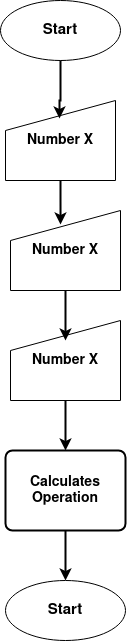
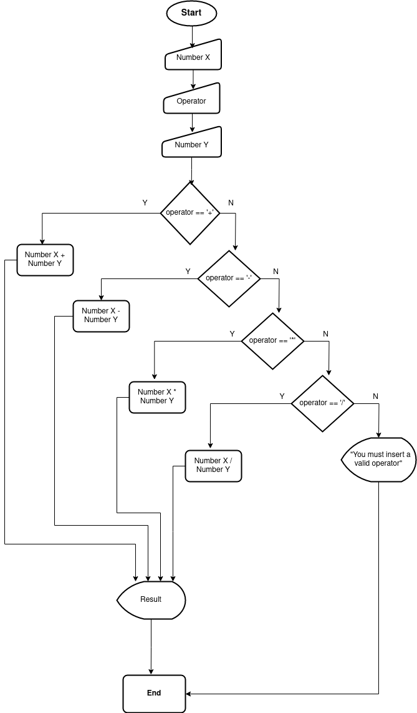

# 🧮 Calculator

<!--Why did i do this? What have I done? How I've done?
-- Dificulties? Which doubts came to my mind?
-- How can it be better? How do I feel? -->

<!-- What is this?--->
This a calculator capable of performing basic math operations. It runs through console, asking user for inputs, then performing the chosen operation and printing it on screen.

## 🎯 Why did I do this?

After realizing I've mostly solved programming logic problems and followed tutorials, I missed having a program that that did not answer a given question or follow a given solution. So I thought for a while _"What am I capable of doing now?"_ ,_"What can I do to test myself?"_,_"Which program would have room for improvements?"_ , and then the present idea was born: _"A calculator!"_.

So, why a calculator? As you may imagine, it fits quite well the previous questions. "Calculator" is something with a very large variety of possiblities. It can be your everyday shop assistant, it could be a tool for doing you taxes, or it could be the helping hand for your calculus and geometry problems. "Calculator" could be anything between somenething that adds 1 to 1 to a tool that helps you to figure out enthropy -- And that is truly Amazing! 

I'm actually quite happy about this! it can be anything my skills allow me to achive: I wonder what it'll have become a year from now. Now, let's proceed to the fabrication process!

## 🛠 How I have done this calculator?

Briefing about what I did and you're about to read:

1. Bullet points about a general calculator;
2. Diagram about generic calculator
3. Diagram clarifying how my calculator would be done;
4. Pseudocode
5. Coding in Java

### 📃 The List
I started taking notes,to figure out what to do: _"How to a calculator?"_, _"What a calculator does?"_. From these questions I made up list:
1. Receives number inputs;
2. Receives an input that defines an operation;
3. Does the operation;
4. Displays operation's result.

### 🔷 🔴 The Diagram
Then I proceded to make a basic diagram, as I want to practice documentation and design,to make my own ideias more clear and to be able to present them better:

<!--Insert basic flowchart about calculators in general-->

<!--Insert flowchart about current calculator-->


<div style="display: flex; align-items: center; justify-content: center;">
  <div style="flex: 1; margin-right: 10px;">
    <p align="center">
      
    </p>
  </div>
  <div style="flex: 1; margin-left: 10px;">
    <p align="center">
      
    </p>
  </div>
</div>
<!--images formatting and display as a courtesy of ChatGPT-->


Then I wrote a pseudocode representing the program:

### 📝 (Pseudo)Coding time
```
Program"Caculator"

Var
    float: numberX, numberY, result
    char: operator

Start    

    print("Insert the first number: )
     scan(numberX)
    print("Choose a valid operation ( + , - , * , / ) : ")
     scan(operator)
    print("Insert the second number: )
     scan(numberY)

    if ( operator == '+' ) {
        result = numberX + numberY
    } else if ( operator == '-' ) {
               result = numberX - numberY
        } else if ( operator == '*' ) {
                    result = numberX * numberY
            } else if ( operator == '/' ) {
                       result = numberX / numberY                
                } else {
                    print("You must insert a valid operation ( + , - , * , / )")
                    }

    print( numberX, operator, numberY, " = ", result)

End 
```

<br>

### 💻 (Java)Coding time
At least, I coded the algorithm using Eclipse. This process may look long and reduntant, but it was actually sketched on papper, so the time spent was thinking-related and not tool-related. That being said, when I started coding in Java I had a very clear direction in mind, barely faced errors, the ones I faced were typing related not design related, and I'm sure this will make a great difference as I enage in more complex projects and as this very project complexity incresases.

Not only that, I found out it is actually satisfying to be able to design using diagrams. I tried in the past some times, but I failed to make something understandable and useful: this was the first time I actually felt that I was in fact constructing a solution and making it easy to follow using diagrams. I believe practicing this will be very helpful when colaborating (and also some time from now, when I come back to my own code, I feel that sensation of _"Jesus, what does this means? How does it even runs!?"_  will be greatly diminished).

If you read all the way up-down to here, I'm truly grateful. Thanks for your time, I hope you have a wonderful day!